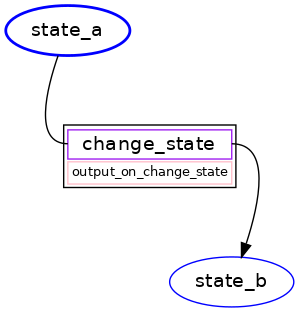

# Installation

To create state machine graphs you must install `automat` with the graphing dependencies.

```
pip install automat[visualize]
```

# Example

Given the following project structure:

```
mystate/
├── __init__.py
└── machine.py
```

And the following state machine defined in `machine.py`

```
from automat import MethodicalMachine

class MyMachine(object):
    _machine = MethodicalMachine()

    @_machine.state(initial=True)
    def state_a(self):
        """
        State A
        """

    @_machine.state()
    def state_b(self):
        """
        State B
        """

    @_machine.input()
    def change_state(self):
        """
        Change state
        """

    @_machine.input()
    def output_on_change_state(self):
        """
        Change state
        """
        return "Changing state"

    state_a.upon(change_state, enter=state_b, outputs=[output_on_change_state])
```

You can generate a state machine visualization by running:

```
$ automat-visualize mystate
mystate.machine.MyMachine._machine ...discovered
mystate.machine.MyMachine._machine ...wrote image and dot into .automat_visualize
```


The `dot` file and `png` will be saved in the default output directory of `.automat_visualize/mystatemachine.MyMachine._machine.dot.png`




# `automat-visualize` help

```
$ automat-visualize -h
usage: /home/tom/Envs/tmp-72fe664d2dc5cbf/bin/automat-visualize
       [-h] [--quiet] [--dot-directory DOT_DIRECTORY]
       [--image-directory IMAGE_DIRECTORY]
       [--image-type {gv,vml,dot_json,imap_np,pov,tiff,pic,canon,jpg,ismap,sgi,webp,gd,json0,ps2,cmapx_np,plain-ext,wbmp,xdot_json,ps,cgimage,ico,gtk,pct,gif,json,fig,xlib,xdot1.2,tif,tk,xdot1.4,svgz,gd2,jpe,psd,xdot,bmp,jpeg,x11,cmapx,jp2,imap,png,tga,pict,plain,eps,vmlz,cmap,exr,svg,pdf,vrml,dot}]
       [--view]
       fqpn

Visualize automat.MethodicalMachines as graphviz graphs.

positional arguments:
  fqpn                  A Fully Qualified Path name representing where to find
                        machines.

optional arguments:
  -h, --help            show this help message and exit
  --quiet, -q           suppress output
  --dot-directory DOT_DIRECTORY, -d DOT_DIRECTORY
                        Where to write out .dot files.
  --image-directory IMAGE_DIRECTORY, -i IMAGE_DIRECTORY
                        Where to write out image files.
  --image-type {gv,vml,dot_json,imap_np,pov,tiff,pic,canon,jpg,ismap,sgi,webp,gd,json0,ps2,cmapx_np,plain-ext,wbmp,xdot_json,ps,cgimage,ico,gtk,pct,gif,json,fig,xlib,xdot1.2,tif,tk,xdot1.4,svgz,gd2,jpe,psd,xdot,bmp,jpeg,x11,cmapx,jp2,imap,png,tga,pict,plain,eps,vmlz,cmap,exr,svg,pdf,vrml,dot}, -t {gv,vml,dot_json,imap_np,pov,tiff,pic,canon,jpg,ismap,sgi,webp,gd,json0,ps2,cmapx_np,plain-ext,wbmp,xdot_json,ps,cgimage,ico,gtk,pct,gif,json,fig,xlib,xdot1.2,tif,tk,xdot1.4,svgz,gd2,jpe,psd,xdot,bmp,jpeg,x11,cmapx,jp2,imap,png,tga,pict,plain,eps,vmlz,cmap,exr,svg,pdf,vrml,dot}
                        The image format.
  --view, -v            View rendered graphs with default image viewer

You must have the graphviz tool suite installed. Please visit
http://www.graphviz.org for more information.

```
